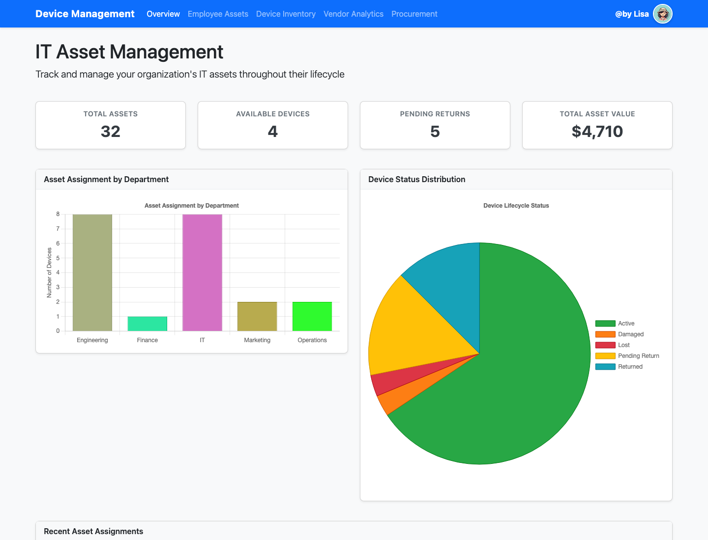
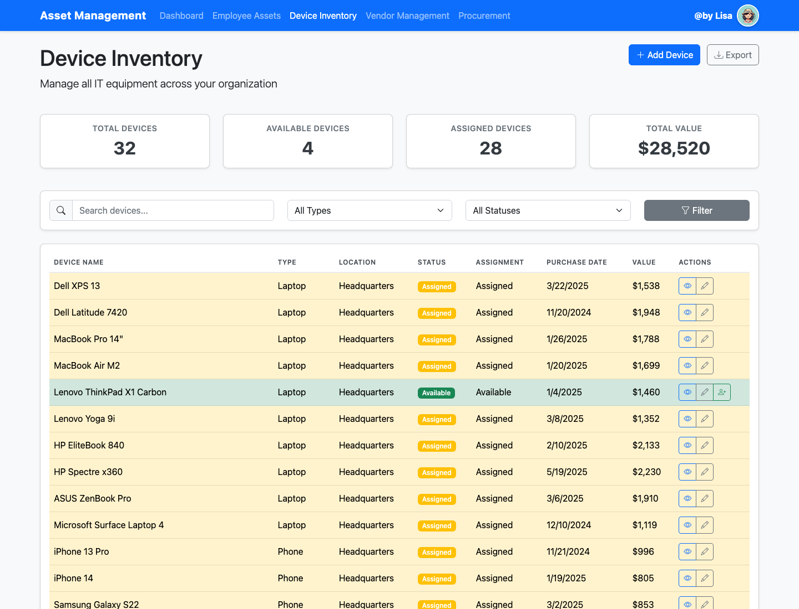
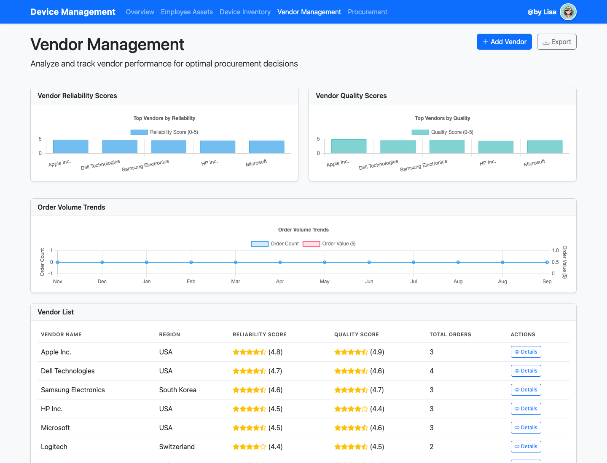

# IT Asset Management Dashboard

> A full-stack IT operations prototype for managing company devices, employee assignments, vendors, and procurement workflows from one central dashboard.

This personal project demonstrates how a lightweight internal tool can give IT and Operations teams a clear view of the complete asset lifecycle—from purchasing and inventory tracking to employee assignment and return.

## Demo

### Management Overview



The overview brings together key operational metrics, asset allocation by department, device lifecycle status, and recent employee assignments.

### Device Inventory



The inventory workspace supports device search and filtering, availability tracking, asset details, editing, and employee assignment workflows.

### Vendor Analytics



Vendor performance is presented through reliability and quality scores, order history, spend data, and visual comparisons.

## Key Features

- **Executive dashboard** — monitors total assets, available devices, pending returns, asset value, department allocation, and lifecycle status.
- **Device inventory** — provides searchable and filterable inventory records with availability, location, purchase date, and value data.
- **Employee asset lifecycle** — tracks device assignments, expected return dates, return status, and assignment history.
- **Vendor analytics** — compares supplier reliability, quality, order volume, and total spend through interactive charts and tables.
- **Procurement tracking** — organizes purchase orders by workflow status and provides order-level operational visibility.
- **Interactive workflows** — supports viewing and updating devices, assigning equipment, and managing asset returns through modal-based actions.
- **REST-style API** — serves dashboard, inventory, employee, supplier, and procurement data to the frontend.
- **Demo data pipeline** — includes scripts and a pre-populated SQLite database for immediate local exploration.

## Tech Stack

| Layer | Technologies |
| --- | --- |
| Backend | Python, Flask, Flask-CORS |
| Data & ORM | SQLite, SQLAlchemy, pandas |
| Frontend | HTML5, CSS3, JavaScript (ES6) |
| UI & Visualization | Bootstrap 5, Bootstrap Icons, Chart.js |
| Demo Data | Faker, custom ETL and data-generation scripts |

## Architecture

```text
Browser UI (Bootstrap + Chart.js)
              ↓ fetch()
Flask routes and JSON API
              ↓
SQLAlchemy ORM
              ↓
SQLite demo database
```

The project uses server-rendered Flask templates for page structure and JavaScript modules for asynchronous data loading, filtering, charts, and user interactions.

## Getting Started

### 1. Clone the repository

```bash
git clone <repository-url>
cd it_management_mock
```

### 2. Create and activate a virtual environment

```bash
python3 -m venv .venv
source .venv/bin/activate
```

On Windows:

```bash
.venv\Scripts\activate
```

### 3. Install dependencies

```bash
pip install -r requirements.txt
```

### 4. Run the application

```bash
python run.py
```

Open [http://127.0.0.1:5000](http://127.0.0.1:5000) in your browser.

The repository includes a sample SQLite database. If the database is removed, the application automatically runs the included data-generation and ETL scripts on the next launch.

## Project Structure

```text
it_management_mock/
├── app/                 # Flask app, routes, models, and utilities
├── data/                # Demo-data generation, ETL, and SQLite database
├── static/              # CSS, JavaScript, and image assets
├── templates/           # Flask/Jinja page templates
├── docs/screenshots/    # README demo images
├── tests/               # Test package
├── run.py               # Local application entry point
└── requirements.txt     # Python dependencies
```

## What This Project Demonstrates

- Translating an operational business need into a usable internal product
- Designing relational data models for assets, employees, suppliers, orders, and deliveries
- Building backend APIs and connecting them to a responsive frontend
- Presenting operational data through dashboards and interactive visualizations
- Creating maintainable workflows across inventory, assignment, vendor, and procurement domains

## Future Improvements

- Add role-based authentication and authorization
- Introduce automated API and UI test coverage
- Add CSV/PDF export and audit logging
- Containerize the application and deploy a public live demo
- Add notifications for low stock, overdue returns, and delayed orders

## Author

Built as a personal portfolio project by **Lisa**.
